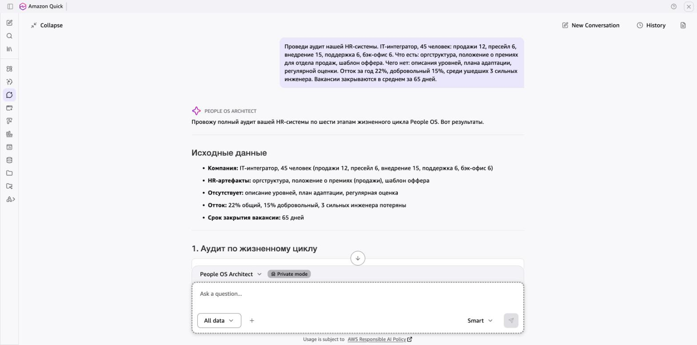
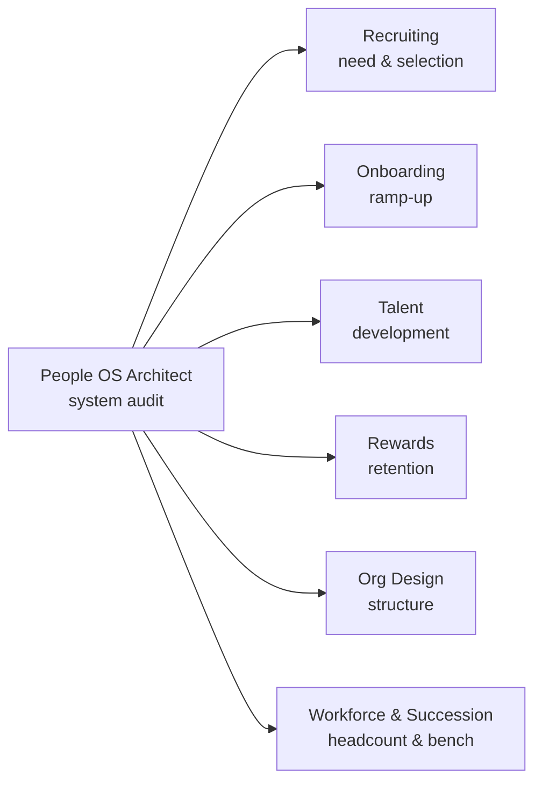

<a href="README.md">Русский</a> · <b>English</b>

<h1 align="center">People OS Agents</h1>

<b>7 open-source AI agents for HR across the full employee lifecycle</b> Hiring · Onboarding · Competencies & 9-box · Rewards · Org design · Succession

  
  
  
  
  
  

## Why these agents are different

Most HR prompts ask a model to "act as an expert" and then guess. These agents work differently:

- **They follow a methodology.** Hiring funnel, STAR interviews, DISC, 30-60-90, 9-box, Total Rewards, span of control, workforce planning.
- **They show the math.** Every number is calculated from data; when data is missing, the agent says exactly what is missing.
- **They never make people decisions.** Hiring, pay, termination and 9-box placement always stay with humans. Protected characteristics (gender, age, etc.) are flagged, never used.
- **They answer in tables** you can take straight into a meeting.

## Agents

| | Agent | What it does | English prompt |
|---|---|---|---|
| 🧭 | [People OS Architect](agents/00-people-os-architect) | Audits the whole HR system and routes each stage to a specialist agent | [instructions.en.md](agents/00-people-os-architect/instructions.en.md) |
| 🎯 | [Recruiting Agent](agents/01-recruiting-agent) | Hiring funnel analysis, structured interview guides, EVP check of job ads | [instructions.en.md](agents/01-recruiting-agent/instructions.en.md) |
| 🚀 | [Onboarding Agent](agents/02-onboarding-agent) | 30-60-90 plans with verifiable goals, onboarding style from a DISC hypothesis | [instructions.en.md](agents/02-onboarding-agent/instructions.en.md) |
| 📈 | [Talent Agent](agents/03-talent-agent) | Behavioral competency models and fair 9-box calibration | [instructions.en.md](agents/03-talent-agent/instructions.en.md) |
| 💰 | [Rewards Agent](agents/04-rewards-agent) | Total Rewards and sales compensation plan review | [instructions.en.md](agents/04-rewards-agent/instructions.en.md) |
| 🏗 | [Org Design Agent](agents/05-org-design-agent) | Span of control and management layers, scenarios not decisions | [instructions.en.md](agents/05-org-design-agent/instructions.en.md) |
| 👥 | [Workforce & Succession Agent](agents/06-workforce-succession-agent) | From revenue plan to headcount plan, succession for critical roles | [instructions.en.md](agents/06-workforce-succession-agent/instructions.en.md) |

English agents answer in the user's language, so the same prompt works for international teams.

## Examples

See how the agents handle real tasks: 7 worked examples in [`examples/`](examples) — HR system audit, hiring funnel, 30-60-90 plan, competency model, sales compensation, org structure and headcount plan (answers in Russian).

## How they connect

Start with **People OS Architect**: it audits the HR system and, for each stage, tells you which agent to use and what exact question to ask.

## Quick start

| Platform | How to set up |
|---|---|
| **Amazon Quick** | Chat agents → Create chat agent → Blank. Paste `instructions.en.md` into *Instructions*; upload the methodology files and your company data as *Reference documents* |
| **Claude (claude.ai)** | Zip the agent's folder from [`skills-en/`](skills-en) and upload it in Settings → Capabilities → Skills. Or create a Project and paste `instructions.en.md` into the project instructions |
| **Claude Code** | Copy a folder from `skills-en/` to `~/.claude/skills/` |
| **ChatGPT** | Explore GPTs → Create → Configure. `instructions.en.md` → Instructions, methodology files → Knowledge |

## Methodology

The [`methodology/`](methodology) folder contains the reference documents the agents rely on: People OS lifecycle, SCAN and the AI adoption loop, competency model, structured interview, hiring funnel, EVP, 30-60-90, DISC, 9-box, Total Rewards, sales compensation, span of control, workforce and succession planning. They are currently in Russian; English versions are coming. In-depth breakdowns live on [KZSalesHub](https://kzsaleshub.com/people-os/).

## Important

The agents help prepare materials and do not replace an HR professional. Before uploading real employee data, make sure your platform and its settings meet your company's requirements and data protection laws.

## Author & license

[Ruslan Omarov](https://www.linkedin.com/in/ruslanomarov/) · open community [KZSalesHub](https://kzsaleshub.com) · [Telegram](https://t.me/KZSalesHub)

Licensed under [CC BY 4.0](LICENSE): free to use, adapt and share, including commercially, with attribution. Issues and pull requests are welcome.
