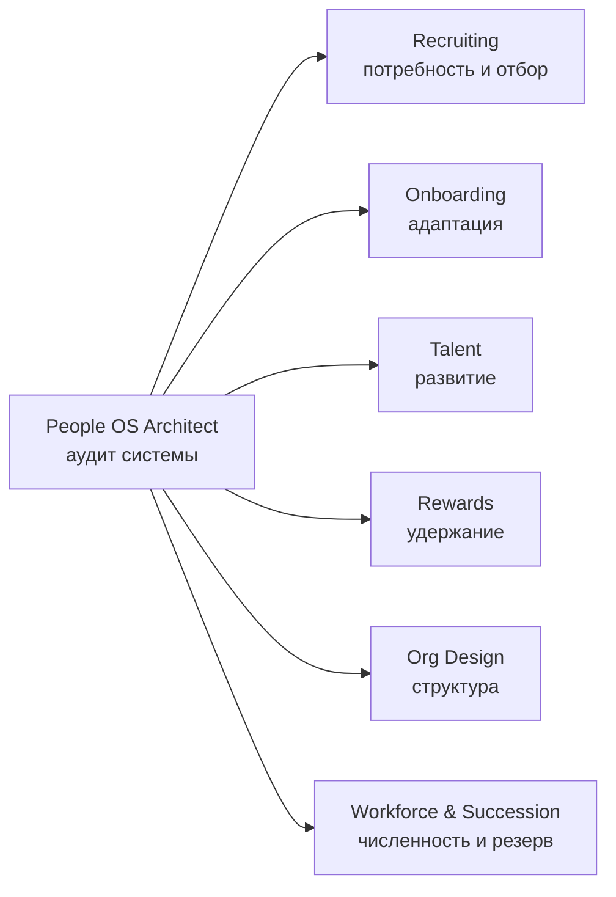

<p align="center"><b>Русский</b> · <a href="README.en.md">English</a></p>

<h1 align="center">People OS Agents</h1>
<p align="center"><b>7 ИИ-агентов для HR по всему жизненному циклу сотрудника</b><br>Найм · Онбординг · Компетенции и 9-box · Вознаграждение · Оргдизайн · Кадровый резерв</p>

<p align="center">
  
  
  
  
  
  
</p>

> *EN: Seven open-source HR agents covering the full employee lifecycle. Prompts are in Russian and work in Amazon Quick, Claude (Skills / Projects / Claude Code) and ChatGPT.*

## Зачем это

Большинство HR-промптов просят модель «быть экспертом» и дальше угадывать. Эти агенты устроены иначе:

- **Работают по методологии.** Воронка найма, STAR-интервью, DISC, 30-60-90, 9-box, Total Rewards, span of control, планирование численности.
- **Показывают расчёт.** Каждая цифра посчитана из данных, а если данных нет, агент прямо говорит, чего не хватает.
- **Не принимают кадровых решений.** Найм, оплата, увольнение и ячейка 9-box всегда остаются за человеком. Защищённые признаки (пол, возраст и т. д.) агенты флагуют, а не учитывают.
- **Отвечают таблицами**, которые можно сразу нести на встречу.

## Агенты

| | Агент | Что делает |
|---|---|---|
| 🧭 | [**People OS Architect**](agents/00-people-os-architect) | Аудит HR-системы по жизненному циклу сотрудника: что должно быть написано, что мерить, где AI заменяет, а где решает человек (SCAN). |
| 🎯 | [**Recruiting Agent**](agents/01-recruiting-agent) | Анализирует воронку найма, готовит структурированные интервью и проверяет вакансии на соответствие EVP. |
| 🚀 | [**Onboarding Agent**](agents/02-onboarding-agent) | Строит план 30-60-90 с проверяемыми целями и подбирает стиль онбординга по поведенческому профилю DISC. |
| 📈 | [**Talent Agent**](agents/03-talent-agent) | Описывает компетенции поведением, а не прилагательными, и готовит честную калибровку 9-box без самосбывающихся ярлыков. |
| 💰 | [**Rewards Agent**](agents/04-rewards-agent) | Разбирает вознаграждение по Total Rewards и схемы мотивации продавцов: внутренняя справедливость, простота формулы, пакет под сегмент. |
| 🏗 | [**Org Design Agent**](agents/05-org-design-agent) | Считает диапазон управляемости и глубину иерархии по оргструктуре и предлагает сценарии, а не решения. |
| 👥 | [**Workforce & Succession Agent**](agents/06-workforce-succession-agent) | Переводит план по выручке в план по людям и строит кадровый резерв по критичным ролям. |

## Примеры

Как агенты отвечают на реальные задачи — 7 разборов в папке [`examples/`](examples): аудит HR-системы, воронка найма, план 30-60-90, модель компетенций, схема мотивации, оргструктура и план численности.


## Как они связаны

Начни с **People OS Architect**: он проводит аудит всей HR-системы и для каждого этапа говорит, к какому агенту идти и какой вопрос задать.



## Методология

В папке [`methodology/`](methodology) лежат справочные документы, на которых работают агенты: жизненный цикл People OS, SCAN и цикл внедрения AI, модель компетенций, структурированное интервью, воронка найма, EVP, 30-60-90, DISC, 9-box, Total Rewards, схема мотивации продавцов, span of control, планирование численности и кадровый резерв. Подключай их к агенту как reference documents вместе со своими данными.

Подробные разборы с примерами — на [KZSalesHub](https://kzsaleshub.com/people-os/) в системе People OS.

## Английская версия

У каждого агента есть `instructions.en.md`, а в папке [`skills-en/`](skills-en) — готовые Claude Skills на английском. Английские агенты отвечают на языке пользователя. Описание на английском: [README.en.md](README.en.md).

## Быстрый старт

1. Открой папку нужного агента в [`agents/`](agents).
2. Скопируй текст из `instructions.md` в свою платформу.
3. Загрузи как файлы знаний справочные документы из `methodology/` и данные компании по описанию из `knowledge/README.md`.

Пошаговые инструкции для Amazon Quick, Claude и ChatGPT: [docs/install.md](docs/install.md).

## Структура репозитория

```
agents/
  00-people-os-architect/
    README.md          описание и примеры запросов
    instructions.md    системный промпт (для Quick, ChatGPT, Claude Projects)
    instructions.en.md то же на английском
    SKILL.md           тот же агент в формате Claude Skill
    knowledge/         какие данные подготовить для агента
  01-recruiting-agent/
  ...
methodology/ru/         справочные документы по методологиям
skills-en/             Claude Skills на английском
examples/              примеры ответов агентов
docs/install.md        установка по платформам
```

## Важно

Агенты помогают готовить материалы и не заменяют HR-специалиста. Перед загрузкой реальных данных сотрудников проверь, что платформа и её настройки соответствуют требованиям твоей компании и законодательства о персональных данных.

## Автор и лицензия

[Руслан Омаров](https://www.linkedin.com/in/ruslanomarov/) · открытое сообщество [KZSalesHub](https://kzsaleshub.com) · [Telegram](https://t.me/KZSalesHub)

Лицензия [CC BY 4.0](LICENSE): можно использовать, менять и распространять, в том числе в коммерческих целях, со ссылкой на источник. Предложения и улучшения приветствуются через Issues и Pull Requests.
