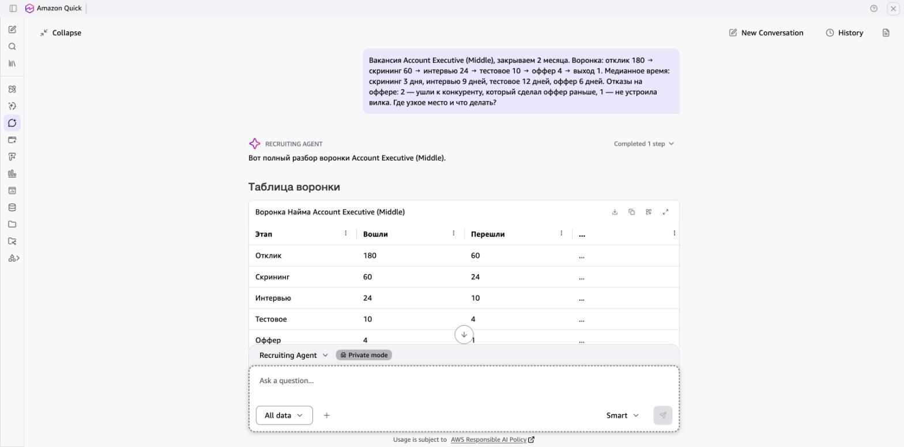

# Пример: Recruiting Agent — разбор воронки найма

> Реальный ответ агента в Amazon Quick. Данные в запросе вымышленные.

**Так это выглядит в Amazon Quick:**

## Запрос

> Вакансия Account Executive (Middle), закрываем 2 месяца. Воронка: отклик 180 → скрининг 60 → интервью 24 → тестовое 10 → оффер 4 → выход 1. Медианное время: скрининг 3 дня, интервью 9 дней, тестовое 12 дней, оффер 6 дней. Отказы на оффере: 2 — ушли к конкуренту, который сделал оффер раньше, 1 — не устроила вилка. Где узкое место и что делать?

## Ответ агента

Вот полный разбор вашей воронки по Account Executive (Middle).

| Этап | Вошли | Перешли | Конверсия | Медиана дней |
|---|---|---|---|---|
| Отклик | 180 | 60 | 33,3% | — |
| Скрининг | 60 | 24 | 40,0% | 3 |
| Интервью | 24 | 10 | 41,7% | 9 |
| Тестовое | 10 | 4 | 40,0% | 12 |
| Оффер | 4 | 1 | 25,0% | 6 |
| Выход | 1 | — | — | — |

Общая конверсия отклик → выход: **0,56%**. Суммарное медианное время от скрининга до оффера: **30 дней**.

---

### 🔴 Главное узкое место: связка «Тестовое → Оффер → Выход»

Проблема не в одном этапе, а в цепочке, где **скорость убивает конверсию**:

1. **Тестовое — 12 дней медианы** — это самый длинный этап воронки. За 12 дней сильные кандидаты получают офферы от конкурентов.
2. **Оффер — 25% конверсии** — самая низкая во всей воронке. Из 4 кандидатов вышел только 1.

### Разбор отказов на оффере по кодам

| Код | Кол-во | Доля | Описание |
|---|---|---|---|
| СКОРОСТЬ | 2 | 67% | Ушли к конкуренту, который сделал оффер раньше |
| ДЕНЬГИ | 1 | 33% | Не устроила вилка |

**2 из 3 отказов — СКОРОСТЬ.** Кандидаты не отказались от вас — они просто не дождались. Это подтверждает, что 12 дней на тестовое + 6 дней на оффер = **18 дней** от интервью до оффера — слишком долго для рынка Account Executive.

---

### Гипотезы и эксперимент

**Гипотеза 1 (основная): Длительность тестового задания — главная причина потери финалистов.** 12 дней медианы означает, что кандидаты либо делают задание долго (оно объёмное), либо мы долго проверяем. В обоих случаях конкуренты успевают закрыть кандидата.

**Гипотеза 2: Вилка ниже рынка.** 1 из 3 отказов — деньги. При выборке 3 это не статистика, но стоит проверить вилку по рынку.

### Рекомендуемый эксперимент

> **Сократить тестовое до 3 дней** — заменить полноценное задание на мини-кейс (30–60 минут, выполняется на интервью или в тот же день). Проверку — в течение 1 дня. Оффер — в течение 1 дня после тестового.

**Метрика успеха:** медиана «интервью → оффер» ≤ 5 дней; конверсия оффер → выход ≥ 60% на следующих 5 офферах.

---

### Дополнительное наблюдение

Конверсия **отклик → скрининг (33,3%)** тоже низкая — отсеивается 2/3 откликов. Возможно, описание вакансии привлекает нецелевых кандидатов. Но это вторичная проблема — сначала стоит починить скорость на финальных этапах.

---

[← Все примеры](README.md) · [Агент](../agents/01-recruiting-agent)
