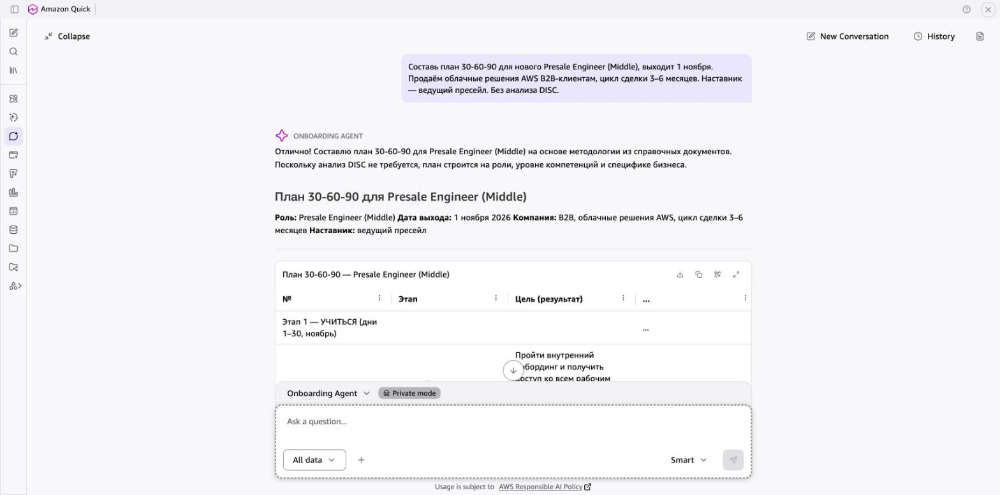

# Пример: Onboarding Agent — план 30-60-90

> Реальный ответ агента в Amazon Quick. Данные в запросе вымышленные.

**Так это выглядит в Amazon Quick:**

## Запрос

> Составь план 30-60-90 для нового Presale Engineer (Middle), выходит 1 ноября. Продаём облачные решения AWS B2B-клиентам, цикл сделки 3–6 месяцев. Наставник — ведущий пресейл. Без анализа DISC.

## Ответ агента

Отлично! Составлю план 30-60-90 для Presale Engineer (Middle) на основе методологии из справочных документов. Поскольку анализ DISC не запрашивается, план строится на роли, уровне компетенций и специфике бизнеса.

---

### Контекст

- **Роль:** Presale Engineer (Middle)
- **Дата выхода:** 1 ноября 2026
- **Продукт:** облачные решения AWS для B2B-клиентов
- **Цикл сделки:** 3–6 месяцев
- **Наставник:** ведущий пресейл-инженер

---

| Этап | № | Цель (результат) | Критерий проверки | Кто подтверждает | Срок |
|---|---|---|---|---|---|
| **30 дней — Учиться** | 1 | Сдать внутренний экзамен по продуктовому портфелю AWS (ключевые сервисы: EC2, S3, RDS, Lambda, VPC, IAM и др.) | Результат теста ≥ 80 % | Наставник | 21 ноября |
|  | 2 | Самостоятельно провести демо-презентацию стандартного облачного решения (IaaS/PaaS) перед наставником | Наставник оценивает по чек-листу: структура, техническая точность, ответы на вопросы — минимум 7/10 | Наставник | 25 ноября |
|  | 3 | Задокументировать текущий процесс пресейла: этапы воронки в CRM, шаблоны КП, типовые архитектурные схемы | Документ согласован наставником и содержит ≥ 90 % актуальных артефактов | Наставник | 28 ноября |
|  | 4 | Присутствовать минимум на 5 клиентских звонках/встречах наставника и подготовить письменный разбор каждой (возражения клиента, предложенное решение, итог) | 5 разборов сданы, наставник подтвердил корректность выводов | Наставник | 30 ноября |
| **60 дней — Вносить вклад** | 5 | Самостоятельно подготовить и отправить 3 технических коммерческих предложения (КП) для реальных сделок | КП прошли ревью наставника с ≤ 2 правками каждое; отправлены клиенту | Наставник + менеджер по продажам | 20 декабря |
|  | 6 | Провести 2 технические презентации / discovery-сессии с клиентами при поддержке наставника | Клиент переходит на следующий этап воронки (или получен конструктивный фидбэк); наставник оценивает выступление ≥ 7/10 | Наставник + менеджер по продажам | 25 декабря |
|  | 7 | Разработать 1 типовую архитектурную схему решения (reference architecture) для повторяющегося сценария клиентов | Схема утверждена наставником и добавлена в базу знаний команды | Наставник | 28 декабря |
|  | 8 | Получить или начать подготовку к сертификации AWS Solutions Architect Associate (или эквивалент) | Зарегистрирован на экзамен / пройдено ≥ 70 % учебного курса | Наставник | 31 декабря |
| **90 дней — Действовать самостоятельно** | 9 | Вести ≥ 3 пресейл-проектов параллельно без постоянного участия наставника | Все проекты имеют актуальный статус в CRM; наставник подключается только по запросу | Руководитель + наставник | 20 января |
|  | 10 | Закрыть (или довести до стадии «согласование договора») минимум 1 сделку, где сотрудник был основным пресейлом | Сделка в CRM на стадии ≥ «Согласование договора» | Руководитель + менеджер по продажам | 28 января |
|  | 11 | Провести внутренний мини-тренинг или knowledge-sharing для команды по одному из AWS-сервисов / кейсу | Проведена сессия ≥ 30 мин, ≥ 3 участника, собрана обратная связь | Руководитель | 25 января |
|  | 12 | Подготовить самооценку по итогам испытательного срока: достижения, зоны роста, план развития на следующий квартал | Документ представлен руководителю на финальной встрече | Руководитель | 29 января |

---

### Контрольные точки

- **День 30 (30 ноября)** — встреча с наставником: статус по целям 1–4. Если ≥ 2 целей не выполнены → рекомендуется встреча с HRBP для корректировки плана.
- **День 60 (31 декабря)** — встреча с наставником и руководителем: статус по целям 5–8. Если ≥ 2 целей не выполнены → встреча с HRBP.
- **День 90 (29 января 2027)** — финальная встреча с руководителем: статус по целям 9–12, решение по итогам испытательного срока. Итог испытательного срока определяет руководитель.

### Рекомендации по сопровождению

- **1:1 с наставником** — еженедельно в первые 30 дней, раз в 2 недели далее.
- **Через 2 недели после выхода (≈ 15 ноября)** — предложить сверить наблюдения наставника о стиле коммуникации сотрудника, чтобы при необходимости адаптировать формат онбординга.
- **CRM-гигиена** — с первого дня фиксировать все активности в CRM, чтобы прогресс был прозрачен.

---

---

[← Все примеры](README.md) · [Агент](../agents/02-onboarding-agent)
