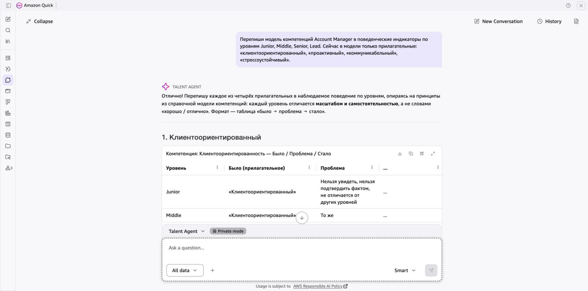

# Пример: Talent Agent — модель компетенций

> Реальный ответ агента в Amazon Quick. Данные в запросе вымышленные.

**Так это выглядит в Amazon Quick:**

## Запрос

> Перепиши модель компетенций Account Manager в поведенческие индикаторы по уровням Junior, Middle, Senior, Lead. Сейчас в модели только прилагательные: «клиентоориентированный», «проактивный», «коммуникабельный», «стрессоустойчивый».

## Ответ агента

Отлично! Перепишу каждое из четырёх прилагательных в наблюдаемое поведение по уровням, опираясь на принципы из справочной модели компетенций: каждый уровень отличается **масштабом и самостоятельностью**, а не словами «хорошо / отлично». Для каждой компетенции покажу таблицу **«Было → Проблема → Стало»**.

---

### 1. Клиентоориентированный → Управление клиентским опытом

**Было:** «клиентоориентированный» **Проблема:** нельзя наблюдать, нельзя подтвердить фактом, не отличает Junior от Lead.

| Уровень | Было (прилагательное) | Проблема | Стало (наблюдаемое поведение) |
|---|---|---|---|
| Junior | клиентоориентированный | Нельзя увидеть; нет разницы с другими уровнями | Отвечает на запрос клиента в рамках SLA; уточняет потребность, если запрос неоднозначен, и пересказывает клиенту, как понял задачу |
| Middle | клиентоориентированный | То же прилагательное — нет отличия от Junior | Сам инициирует регулярные статус-встречи с клиентом; фиксирует обратную связь и передаёт её в продукт/сервис с конкретным описанием кейса |
| Senior | клиентоориентированный | Не описывает масштаб влияния | Выстраивает отношения на уровне нескольких стейкхолдеров клиента; выявляет незакрытые потребности до того, как клиент их озвучит, и предлагает решение с оценкой эффекта |
| Lead | клиентоориентированный | Не описывает системную работу | Формирует стандарт клиентского опыта для команды (playbook, чек-листы); анализирует NPS/CSAT по портфелю и запускает корректирующие действия при падении метрик |

---

### 2. Проактивный → Проактивное управление аккаунтом

**Было:** «проактивный» **Проблема:** субъективная оценка; невозможно проверить фактом.

| Уровень | Было (прилагательное) | Проблема | Стало (наблюдаемое поведение) |
|---|---|---|---|
| Junior | проактивный | Нельзя увидеть; нет критерия | Сообщает руководителю о риске по аккаунту (задержка оплаты, снижение активности) до того, как о нём спросят |
| Middle | проактивный | То же слово — нет отличия от Junior | Сам готовит план развития аккаунта (upsell/cross-sell) на квартал; поднимает риск оттока с данными и предлагает минимум 2 варианта удержания |
| Senior | проактивный | Не описывает масштаб | Выявляет системные паттерны оттока по сегменту клиентов; инициирует кросс-функциональные проекты (с продуктом, маркетингом) для устранения корневых причин |
| Lead | проактивный | Не описывает влияние на процесс | Внедряет early-warning систему по портфелю команды (триггеры, дашборды); пересматривает процесс квартального планирования аккаунтов на основе ретроспективы результатов |

---

### 3. Коммуникабельный → Деловая коммуникация

**Было:** «коммуникабельный» **Проблема:** описывает черту характера, а не действие; нельзя отличить уровни.

| Уровень | Было (прилагательное) | Проблема | Стало (наблюдаемое поведение) |
|---|---|---|---|
| Junior | коммуникабельный | Черта характера, не действие | Задаёт уточняющие вопросы клиенту и пересказывает договорённости письменно (follow-up после встречи) |
| Middle | коммуникабельный | То же слово — нет разницы | Пишет статус по аккаунту так, что его понимают без дополнительных вопросов (сделано / риски / следующие шаги); адаптирует стиль под аудиторию (техническую и бизнес) |
| Senior | коммуникабельный | Не описывает сложность задач | Проводит сложные переговоры (эскалации, пересмотр условий); доносит бизнес-ценность решения до C-level клиента без технического жаргона |
| Lead | коммуникабельный | Не описывает системное влияние | Проводит калибровочные и конфликтные разговоры внутри команды; создаёт шаблоны коммуникации (скрипты, письма, презентации) и обучает команду их использованию |

---

### 4. Стрессоустойчивый → Эффективность в условиях давления

**Было:** «стрессоустойчивый» **Проблема:** нельзя наблюдать напрямую; описывает внутреннее состояние, а не поведение.

| Уровень | Было (прилагательное) | Проблема | Стало (наблюдаемое поведение) |
|---|---|---|---|
| Junior | стрессоустойчивый | Внутреннее состояние, нельзя увидеть | При срочном запросе клиента приоритизирует задачи и сообщает руководителю, если не может уложиться в срок; не замалчивает проблему |
| Middle | стрессоустойчивый | То же слово — нет отличия | Ведёт одновременно 3+ сложных кейса без падения качества (SLA, CSAT); при эскалации клиента собирает факты, а не реагирует эмоционально, и предлагает план решения |
| Senior | стрессоустойчивый | Не описывает влияние на других | Берёт на себя кризисные аккаунты; после разрешения проводит разбор (post-mortem) и фиксирует уроки для команды |
| Lead | стрессоустойчивый | Не описывает системную работу | Выстраивает процесс эскалаций в команде (матрица, SLA, роли); отслеживает нагрузку команды и перераспределяет аккаунты до выгорания сотрудников |

---

### Как проверить каждый индикатор

Каждая формулировка выше прошла три контрольных вопроса:

1. **Можно ли это увидеть?** — Да, описано конкретное действие (написал follow-up, поднял риск, провёл post-mortem).
2. **Можно ли подтвердить фактом?** — Да, есть артефакт или событие (письмо, план, дашборд, запись встречи).
3. **Отличается ли от соседнего уровня?** — Да, уровни различаются масштабом (свои задачи → аккаунт → сегмент → команда) и самостоятельностью.

> ⚠️ **Напоминание:** модель компетенций утверждают руководители направлений. Эти формулировки — предложение для обсуждения, а не финальный документ.

---

[← Все примеры](README.md) · [Агент](../agents/03-talent-agent)
