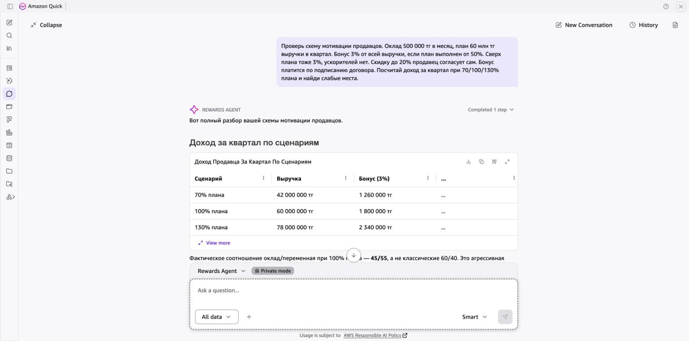

# Пример: Rewards Agent — проверка схемы мотивации продавцов

> Реальный ответ агента в Amazon Quick. Данные в запросе вымышленные.

**Так это выглядит в Amazon Quick:**

## Запрос

> Проверь схему мотивации продавцов. Оклад 500 000 тг в месяц, план 60 млн тг выручки в квартал. Бонус 3% от всей выручки, если план выполнен от 50%. Сверх плана тоже 3%, ускорителей нет. Скидку до 20% продавец согласует сам. Бонус платится по подписанию договора. Посчитай доход за квартал при 70/100/130% плана и найди слабые места.

## Ответ агента

Вот полный разбор вашей схемы мотивации.

### Доход продавца по сценариям (за квартал)

| Показатель | 70% плана | 100% плана | 130% плана |
|---|---|---|---|
| **Выручка** | 42 000 000 тг | 60 000 000 тг | 78 000 000 тг |
| **Оклад (3 мес)** | 1 500 000 тг | 1 500 000 тг | 1 500 000 тг |
| **Бонус (3%)** | 1 260 000 тг | 1 800 000 тг | 2 340 000 тг |
| **ИТОГО за квартал** | **2 760 000 тг** | **3 300 000 тг** | **3 840 000 тг** |
| **Доход в месяц** | 920 000 тг | 1 100 000 тг | 1 280 000 тг |
| **Доля переменной** | 45,7% | 54,5% | 60,9% |

### Тест «считает в уме»

✅ **Формула простая**: сделка на 5 млн → бонус = 150 000 тг. Продавец считает мгновенно.

⚠️ **Но**: продавцу всё равно, *что* продавать — лицензии с маржой 8% или услуги с маржой 35%. Бонус одинаковый.

### Слабые места (6 штук)

#### 🔴 КРИТИЧНО: Скидка 20% убивает прибыль

Это главная дыра в схеме. Пример на сделке 10 млн тг:

| Показатель | Лицензии (маржа 8%) | Услуги (маржа 35%) |
|---|---|---|
| Прибыль компании **без скидки** | 800 000 тг | 3 500 000 тг |
| Прибыль компании **со скидкой 20%** | **−1 200 000 тг (УБЫТОК)** | 1 500 000 тг |
| Бонус продавца без скидки | 300 000 тг | 300 000 тг |
| Бонус продавца со скидкой | 240 000 тг | 240 000 тг |
| Потеря бонуса продавца | 60 000 тг (−20%) | 60 000 тг (−20%) |

**Суть проблемы**: продавец даёт скидку 20% на лицензии → компания теряет 2 000 000 тг и уходит в убыток на −1 200 000 тг. А продавец теряет всего 60 000 тг бонуса. Асимметрия колоссальная: компания теряет в 33 раза больше, чем продавец.

#### 🔴 КРИТИЧНО: Бонус от выручки, маржа не учитывается

Продавцу выгоднее продать лицензий на 10 млн (маржа 800 тыс.) чем услуг на 8 млн (маржа 2 800 тыс.), хотя для компании ровно наоборот. Схема работает **против** интересов бизнеса.

#### 🔴 КРИТИЧНО: Выплата по подписанию, а не по оплате

- Клиент подписал, но не оплатил → продавец бонус уже получил, компания — нет
- Продавец мотивирован «подписать любой ценой», качество клиента не важно
- Нет связи между бонусом и реальным денежным потоком

#### 🟠 ВЫСОКИЙ: Нет ускорителя сверх плана

Ставка 3% одинаковая и до плана, и сверх. Продавец, достигший 100% в середине квартала, рационально **придержит** оставшиеся сделки на следующий квартал, чтобы гарантировать себе порог. Компания теряет выручку.

#### 🟡 СРЕДНИЙ: Порог 50% — скачкообразный

При 49% плана (29,4 млн) бонус = **0 тг**. При 50% (30 млн) бонус = **900 000 тг**. Разница в выручке всего 600 000 тг даёт скачок бонуса в 900 000 тг. Это провоцирует перенос сделок между кварталами и «дотягивание» скидками.

#### 🟡 СРЕДНИЙ: Нет разницы между новыми и текущими клиентами

Продление существующего контракта и привлечение нового клиента оплачиваются одинаково, хотя трудозатраты отличаются кратно.

---

### Что с этим делать

Решение принимают руководитель и HR, но вот направления для проработки:

1. **Привязать бонус к марже**, а не к выручке — или хотя бы ввести разные ставки по продуктам (например, 2% лицензии / 5% услуги)
2. **Ограничить скидку**: скидка >10% — согласование руководителя; скидка, обнуляющая маржу — запрет
3. **Перенести выплату** на момент оплаты клиентом (или хотя бы 50/50: аванс при подписании, остаток при оплате)
4. **Добавить ускоритель**: например, 3% до плана → 5% сверх 100% → 7% сверх 120%
5. **Сгладить порог**: вместо 0/100 при 50% — линейная шкала от 50% (например, при 50% ставка 1,5%, при 100% — 3%)
6. **Дифференцировать** ставку за новых клиентов (выше) и продления (ниже)

---

[← Все примеры](README.md) · [Агент](../agents/04-rewards-agent)
