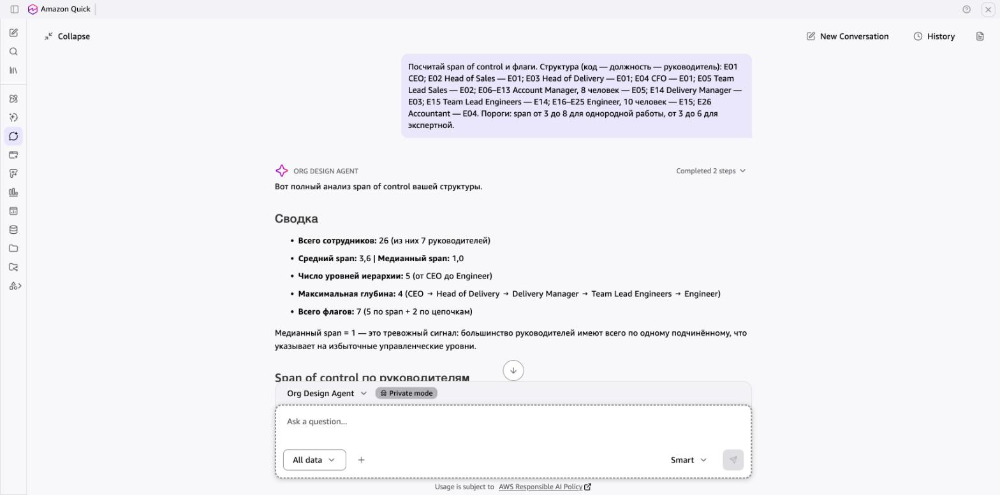

# Пример: Org Design Agent — span of control и уровни иерархии

> Реальный ответ агента в Amazon Quick. Данные в запросе вымышленные.

**Так это выглядит в Amazon Quick:**

## Запрос

> Посчитай span of control и флаги. Структура (код — должность — руководитель): E01 CEO; E02 Head of Sales — E01; E03 Head of Delivery — E01; E04 CFO — E01; E05 Team Lead Sales — E02; E06–E13 Account Manager, 8 человек — E05; E14 Delivery Manager — E03; E15 Team Lead Engineers — E14; E16–E25 Engineer, 10 человек — E15; E26 Accountant — E04. Пороги: span от 3 до 8 для однородной работы, от 3 до 6 для экспертной.

## Ответ агента

Анализ завершён. Вот полные результаты по вашей структуре.

### Сводка

| Показатель | Значение |
|---|---|
| Всего сотрудников | 26 |
| Из них руководителей | 7 |
| Средний span of control | 3,6 |
| Медианный span of control | 1,0 |
| Макс. глубина (CEO → исполнитель) | 4 уровня |
| **Число флагов** | **8** |

Медиана = 1 говорит о том, что большинство руководителей имеют всего по одному подчинённому — это ключевая структурная проблема.

### Span of control по руководителям

| ID | Должность | Span | Тип работы подч. | В пределах нормы? |
|---|---|---|---|---|
| E01 | CEO | 3 | экспертная | ✅ Да (3–6) |
| E02 | Head of Sales | 1 | однородная | ❌ Нет (< 3) |
| E03 | Head of Delivery | 1 | экспертная | ❌ Нет (< 3) |
| E04 | CFO | 1 | экспертная | ❌ Нет (< 3) |
| E05 | Team Lead Sales | 8 | однородная | ✅ Да (3–8) |
| E14 | Delivery Manager | 1 | экспертная | ❌ Нет (< 3) |
| E15 | Team Lead Engineers | 10 | экспертная | ❌ Нет (> 6) |

### Таблица флагов

| # | Руководитель | Должность | Подразделение | Span | Тип работы подч. | Флаг |
|---|---|---|---|---|---|---|
| 1 | E02 | Head of Sales | Sales | 1 | однородная | Span слишком мал (1 < 3) |
| 2 | E03 | Head of Delivery | Delivery | 1 | экспертная | Span слишком мал (1 < 3) |
| 3 | E04 | CFO | Finance | 1 | экспертная | Span слишком мал (1 < 3) |
| 4 | E14 | Delivery Manager | Delivery | 1 | экспертная | Span слишком мал (1 < 3) |
| 5 | E15 | Team Lead Engineers | Delivery | 10 | экспертная | Span слишком велик (10 > 6) |
| 6 | E02 | Head of Sales | Sales | 1 | однородная | Цепочка: единственный подчинённый (E05) тоже руководитель |
| 7 | E03 | Head of Delivery | Delivery | 1 | экспертная | Цепочка: единственный подчинённый (E14) тоже руководитель |
| 8 | E14 | Delivery Manager | Delivery | 1 | экспертная | Цепочка: единственный подчинённый (E15) тоже руководитель |

### Ключевые проблемы

**Проблема 1 — Цепочки «руководитель → руководитель» в Delivery.** Путь E03 → E14 → E15 — это три уровня управления, где каждый имеет ровно одного подчинённого-руководителя. Фактически три роли выполняют функцию передаточного звена.

**Проблема 2 — Head of Sales (E02) с одним подчинённым.** E02 управляет только E05, который уже сам руководит 8 менеджерами. Роль E02 выглядит как промежуточный слой.

**Проблема 3 — CFO (E04) с одним подчинённым.** Финансовый блок состоит из двух человек — руководителя и исполнителя.

**Проблема 4 — Перегрузка Team Lead Engineers (E15).** 10 инженеров при экспертной работе — значительно выше порога 6.

### Сценарии изменений

#### Сценарий 1: Сокращение слоёв в Delivery

Объединить роли E03 (Head of Delivery) и E14 (Delivery Manager) в одну, а также разделить инженеров E15 на две группы по 5 человек с двумя тимлидами.

|  |  |
|---|---|
| ✅ Плюсы | Убирается цепочка из 3 промежуточных уровней; span E15 приходит в норму; ускоряется коммуникация |
| ⚠️ Риски | Объединённая роль получает широкий функционал (и управление, и delivery); нужен подбор/развитие второго тимлида |

#### Сценарий 2: Сокращение слоёв в Sales + расширение Finance

Перевести Team Lead Sales (E05) в прямое подчинение CEO, убрав промежуточный слой E02. Роль Head of Sales переориентировать на стратегию и добавить в подчинение финансовый блок (E26), объединив с CFO-функцией.

|  |  |
|---|---|
| ✅ Плюсы | CEO получает span 4 (в норме); убирается флаг E02; финансовый блок усиливается |
| ⚠️ Риски | Потеря выделенной роли продаж на уровне директора; совмещение Sales-стратегии и Finance может быть нелогичным |

#### Сценарий 3: Комплексное выравнивание

Убрать один слой в Delivery (E03 или E14), перевести E05 напрямую к CEO, разделить инженеров на 2 команды, добавить 1–2 специалиста в Finance.

|  |  |
|---|---|
| ✅ Плюсы | Все span приходят в норму (3–6/3–8); глубина снижается до 3; медианный span растёт |
| ⚠️ Риски | Наибольший объём изменений; требует одновременной перестройки нескольких подразделений; CEO берёт на себя больше прямых подчинённых |

> ⚠️ **Важно:** Это сценарии для обсуждения, а не готовые решения. Решения о реструктуризации, изменении ролей и перемещении сотрудников принимает только человек.

---

[← Все примеры](README.md) · [Агент](../agents/05-org-design-agent)
